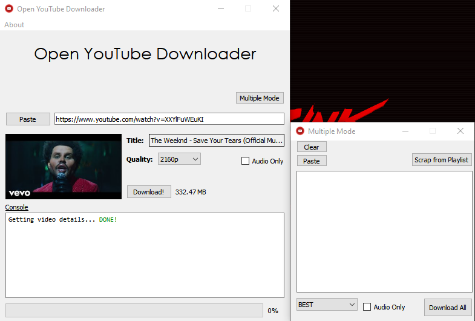

# Open YouTube Downloader

Open YouTube Downloader is completely open source and also multi-thread video downloader. It is developed with Python, Qt and Pytube library. You can copy-paste URL of any video and download it directly to a quality of your choice.

🎄 This application uses [PyQt5](https://pypi.org/project/PyQt5/) and [pytube](https://github.com/pytube/pytube) library

🎬 This application needs [ffmpeg](https://github.com/BtbN/FFmpeg-Builds/releases)

## Download
- 🟢 **[Latest Release](github.com/kurtulusakinim/Open-YouTube-Downloader/releases/latest)**

# Screenshot

# Features
- Download videos from youtube url
- Download only audio
- Selectable video quality
## Multiple mode
- Scrapping video urls from playlist
- Paste urls from clipboard

# Usage
1. Create a folder and move .exe to that folder
2. Add ffmpeg.exe to path or the folder you created
3. Run .exe
